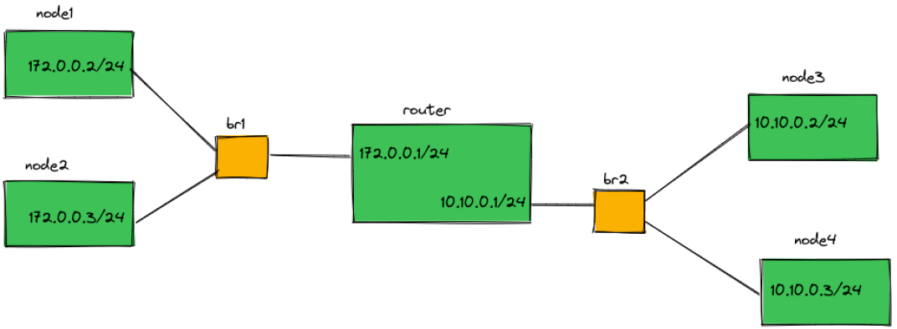

# Problem 1 (Container Networking)
In the following, the explanation of problem 1 from HW2 will be given.


For this problem, 4 scripts have been developed and 2 questions have been answered.

**If you want, you can jump to the contents of that section by clicking on any of the titles below!**

- [create_net.sh](#create_net.sh)
- [pingall.sh](#pingall.sh)
- [ping_node.sh](#ping_node.sh)
- [del_net.sh](#del_net.sh)
- [**Question 1**: How are packets routed from one subnet to another when the router is removed?]()
- [**Question 2**: What if the namespaces are on different servers ... ?]()


## create_net.sh
This script was used to make the following network.
<div style="text-align:center">
  
</div>

In this script, `ip` command is used with different options to make bridge, namespaces, network interfaces, etc.
In order to make the code more readable and clear, a function (`SetupNode()`) is defined in this script, which is used to create all the nodes and the router in the above figure.
In the following, the method of using and calling this function and the details of its body will be explained.

In Bash scripting, functions allow you to organize your code into reusable blocks.

The way to call the function and pass the variable to it is as follows:

  ```bash
SetupNode <namespace> <veth_name> <ip_addr> <bridge> <gateway>  
  ```

- `<namespace>`: Name of namespace that interface will be define in it.
- `<veth_name>`: Name of the virtual interface
- `<ip_addr>`: The ip address of the virtual interface
- `<bridge>`: The bridge to which <veth_name> will be connected.
- `<gateway>`: The ip address of the gateway of <veth_name>. For router interfaces, this value is null.

This is an example of a function call in `create_net.sh`:

  ```bash
# node example
SetupNode "node1" "n1" "172.0.0.2/24" "br1" "172.0.0.1"
# router example
SetupNode "router" "hand1" "172.0.0.1/24" "br1"
  ```

In Bash programming, function inputs are accessible and usable (from left to right) with `$1`, `$2`, `$3`, ...

**In the following, the commands used in the `SetupNode()` and their descriptions are given.**

This command defines a new namespace:

  ```bash
ip netns add <namespace>
# <namespace> example: node1, node2, node3, node4, router
  ```

This command is used to create a pair of virtual Ethernet (veth) interfaces:

  ```bash
ip link add <new-veth-interface> type veth peer name <new-veth-interface-at-other-side>
  ```

- `<new-veth-interface>`: This is the name of the new interface that is created on one side of the veth pair.
- `type veth`: This specifies that the type of the interface being created is a virtual Ethernet interface (veth).
- `peer name <new-veth-interface-at-other-side>`: This specifies the name of the veth interface on the other side of the pair, which will be connected to the bridge or network namespace.

The following command is used to move a network interface to a specific network namespace.

  ```bash
ip link set <new-veth-interface> netns <namespace>
  ```

The following command is used to add a network interface to a bridge. The keyword `master` introduces the master device `<new-veth-interface-at-other-side>` is the device `<bridge>`.

  ```bash
ip link set <new-veth-interface-at-other-side> master <bridge>
  ```

The following command is used to add an IP address (`<ip-address>`) to `<veth-interface>` within `<namespace>` network namespace

  ```bash
ip -n <namespace> addr add <ip-address> dev <veth-interface>
  ```

And the next three commands are used to bring up a network interface. within a specific network namespace in Linux.
Interfaces that are defined in a specific network namespace, their namespace is specified with the `-n`:

  ```bash
  ip -n <namespace> link set dev <veth-interface> up 
  ip -n <namespace> link set dev <loopback-interface> up # Specifically, it means interface 'lo'
  # When the '-n' option is not used, it means that the interface is in the root namespace by default.
  ip link set <veth-interface> up
  ```

And the last `ip` command is used to add a default gateway route within `<namespace>` network namespace.
In `SetupNode()` an if condition is used so that this command is not executed for the interfaces that are connected to the router because these interfaces do not require a default gateway:

  ```bash
  ip netns exec <namespace> ip route add default via <default-gateway-ip-address>
  ```

Also, in order to bypass **iptables processing** so that packets can be exchanged between different namespaces, these four commands have been used:
  
  ```bash
# Bypassing 'iptables processing'
sysctl --write net.bridge.bridge-nf-call-iptables=0
sysctl --write net.bridge.bridge.bridge-nf-call-ip6tables=0
sysctl --write net.bridge.bridge-nf-call-arptables=0
sysctl -p # Applying the changes without rebooting
  ```

## pingall.sh

This script is developed to test the accessibility of all network hosts to each other.
It has been tried to make its output similar to `pingall` command in **Mininet**.

How to run this bash is very simple: `sudo ./pingall.sh`

Two examples of the output results of executing this script.

- All nodes are connected to each other.
```
~/sdmn/hw2/q1$ sudo ./pingall.sh 
*** Testing all nodes reachability
----------------------------------
node1 -> node2 node3 node4 
node2 -> node1 node3 node4 
node3 -> node1 node2 node4 
node4 -> node1 node2 node3 
----------------------------------
*** Results: 12/12 received
```
- Node 3 is disconnected.
```
~/sdmn/hw2/q1$ sudo ./pingall.sh 
*** Testing all nodes reachability
----------------------------------
node1 -> node2   X   node4 
node2 -> node1   X   node4 
node3 ->   X     X     X   
node4 -> node1 node2   X   
----------------------------------
*** Results: 6/12 received
```
